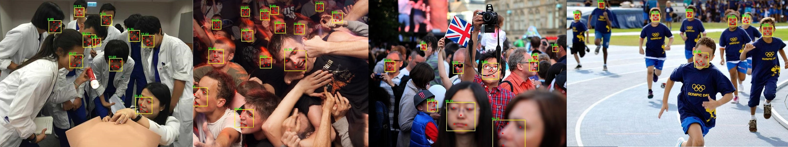

# Recurrent Scale Approximation (RSA) for Object Detection

 

Codebase for *Recurrent Scale Approximation for Object Detection in CNN* published at **ICCV 2017**, [[arXiv]](https://arxiv.org/abs/1707.09531). Here we offer the training and test code for two modules in the paper, `scale-forecast network` and `recurrent scale approximation (RSA)`. Models for face detection trained on some open datasets are also provided.

**Note: This project is still underway. Please stay tuned for more features soon!**

## Codebase at a Glance

`train/`: Training code for modules `scale-forecast network` and `RSA`

`predict/`: Test code for the whole detection pipeline

`afw_gtmiss.mat`: Revised face data annotation mentioned in Section 4.1 in the paper.

## Grab and Go (Demo)

**Caffe models** for face detection trained on popular datasets. 

+ Base RPN model: `predict/output/ResNet_3b_s16/tot_wometa_1epoch`, trained on `Widerface` (fg/bg), `COCO` (bg only) and `ImageNet Det` (bg only)
+ RSA model: `predict/output/ResNet_3b_s16_fm2fm_pool2_deep/65w`, trained on `Widerface`, `COCO`, and `ImageNet Det`

Steps to run the **test** code:

1. Compile [CaffeMex_v2](https://github.com/sciencefans/CaffeMex_v2/) with matlab interface

2. Add `CaffeMex_v2/matlab/` to matlab search path

3. See tips in `predict/script_start.m` and run it!

4. After processing for a few minutes, the detection and alignment results will be shown in an image window. Please click the image window to view all results. If you set line 8 in `script_start.m` to `false` as default, you should observe some results as above.

## Train Your Own Model

Still in progress, this part will be released later.

## FAQ
We will list the common issues of this project as time goes. Stay tuned! :)

## Citation
Please kindly cite our work if it helps your research:

    @inproceedings{liu_2017_rsa,
      Author = {Yu Liu and Hongyang Li and Junjie Yan and Fangyin Wei and Xiaogang Wang and Xiaoou Tang},
      Title = {Recurrent Scale Approximation for Object Detection in CNN},
	  Journal = {IEEE International Conference on Computer Vision},
	  Year = {2017}
    }

## Acknowledgment
We appreciate the contribution of the following researchers:

[Dong Chen](https://www.microsoft.com/en-us/research/people/doch/) @Microsoft Research, some basic ideas are inspired by him when Yu Liu worked as an intern at MSR.

Jiongchao Jin @Beihang University, some baseline results are provided by him.
